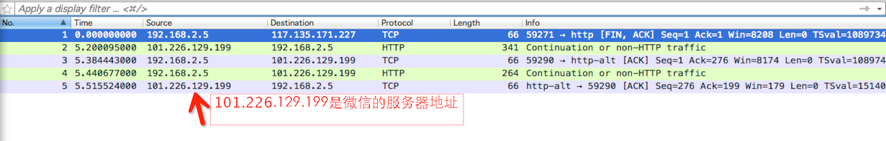
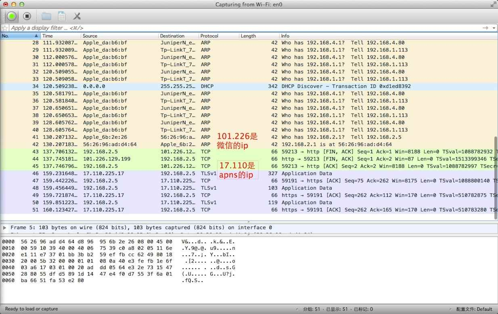

# 微信的长连接

由于工作原因，需要研究客户端在后台时，如何来处理长连接，如何接收消息等操作。

于是，就拿微信来开刀了，看一下微信是如何处理客户端在后台时的操作的。

## 准备工作

### 工具

	Macbook、一个无线网卡（360wifi2）或者 同时带有“有线网卡”和“无线网卡”的笔记本
	wireShark

因为我的笔记本只有无线网卡，所以我就使用 360wifi2 架了一个热点，来抓手机的数据包

（如果有兴趣的话，把手机越狱，安装一个 tcpdump 和 ssh，也可以直接抓手机的包，不过不够直观）

### 安装wifi驱动

360wifi2比较变态，不太支持Mac OS 操作系统，需要做一些修改，可以参考下面这篇文章：[360wifi2 苹果电脑 驱动 教程（最新系统正常）](http://bbs.360safe.com/thread-4099171-1-1.html)

### 架设无线热点

如何架设无线热点，还是可以参考上面那篇文章，选择 “系统偏好设置-->共享” 可以选择需要共享的网络

## 开始抓包
 
将手机连上刚才架设的无线热点，手机的数据包一览无余，不过呢，微信的数据是加密了的，看不了发送的是什么东东，不过这并不妨碍我们去分析它的在后台如何处理长连接。

### 猜测一下它的操作

首先，自己简单测试了一下 **按home键将微信切换到后台** 和 **kill掉微信** 时，图标的右上角 badge的变化，测试流程和结果如下：

	1. 启动微信，然后按home放到后台，另一个号给它发4条消息，它的badge是4
	2. kill 掉微信，再给它发送一条消息，微信收到 apns，badge变为1
	3. 点击进入微信，微信重新启动，进入应用后，微信统计了未读消息，按home键后，badge变为了 5

通过 badge 的变化，能看出来，切换到后台的时候，它走的有可能是 localNotification（因为badge从4变成了1），程序被kill掉后，走的肯定就是 APNS了 。

当然，上面只是猜测，下面我们用抓包来看一下微信的操作

### 抓包流程

1. 登录账号A，将微信切换到后台（记录下切换到后台的时间），查看客户端是否有发送报文到服务器

		通过抓包，可以看到客户端没有发送任何消息到服务器（这里就不截图了，因为截图也是空白的）
		
2. 用另一个手机登录微信，给 A 发消息，查看抓包：

	

	通过上面的截图，可以看到，走的并不是APNS，而是直接从微信的服务器发送过来的报文（至于为什么101.226.129.199为什么是微信的IP，登录的时候，抓包就能知道啦）
	
	**连发4条消息，可以发现微信图标的 badge 变成了4。**
	
3. 客户端继续放置在后台，接着看它的报文，然后突然发现，客户端往服务器发送了一个 FIN 报文（记录下发送 FIN 报文的时间）

	

	从淡绿色的报文中，可以看到，是客户端发送的一个 FIN 到服务器的（这个地方比较奇怪，不知道为什么是客户端先发送的 FIN），然后接着服务器也发了一个 FIN作为回应啥啥咐的。
	
	总的来说呢，这就是一个 disconnect 的报文。
	
4. 客户端发送 FIN 后，另一台手机接着给 A 再发一条消息。

	从上面的图，可以看出 （17.110.225.17 给我发了几条数据过来，嗯，这个应该就是 APNS了，至于为什么这个ip发过来的数据就是APNS了，多抓几次包就知道了）
	
	**同时，你会发现，微信的图标右上角 badge 变为 1了**

5. 接下来，将微信 kill 掉，然后另一台手机再给 A 发送一条消息，可以看到微信图标的右上角 badge 变成了 2 ，同时，从抓包来看，也能看到数据包是从 17.110.225.17 发送过来的。

6. 发送 FIN 报文的时间 与 切换到后台的时间相比，**发现客户端在后台存活的时间，差不多是3分钟左右**。

## 总结
 
通过上面的抓包，可以看到，微信在后台的时候，短时间内是走的localNotification，但使用localNotification的时间是非常短的（**3分钟左右**），连接断开后，就是走的APNS推送了。

## 疑问

 
关于微信它的长连接，还是有以下几点不是特别清楚，后面再来慢慢研究它吧。

	1. 它的长连接走的是哪个协议
	2. 它如何进行自动重连的
	3. 切换到后台，它如何保持只是短时间内运行（当然这里可以用 backgroundHandle来做，但关于它这个连接的机制还不是特别了解）
	4. 切换到后台，再切换到前台时，它怎么进行重连，多长时间连接一次（有的时候，进入微信，可以看到它顶部显示：“收取中。。。”）

